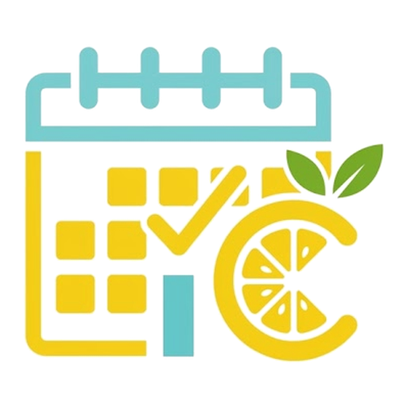

# 🗓️ LICWeekly Planner

<p align="center">
  
</p>

<p align="center">
  <strong>Organizador semanal moderno, elegante y enfocado en la privacidad total (Local-First).</strong><br>
  Combina la calidez y estructura de una libreta física de productividad con la agilidad y precisión de una Progressive Web App (PWA) de alto rendimiento.
</p>

<p align="center">
  
  
  
  
</p>

---

## ✨ Características Principales

### 🔒 1. Privacidad Total & Filosofía Local-First
* **Tus datos te pertenecen:** Toda la información se guarda y sincroniza directamente en un archivo local `.json` en tu propio dispositivo mediante la **File System Access API** (Chrome, Edge, Brave, Opera) o en el almacenamiento persistente (`localStorage`) en navegadores móviles (iOS / Android).
* **Cero telemetría:** No se envían datos a servidores externos, analíticas invasivas ni bases de datos en la nube.
* **Sincronización en la Nube sin intermediarios:** Guarda tu archivo `.json` en tu carpeta de **Google Drive**, **OneDrive**, **Dropbox** o **iCloud Drive** y disfruta de sincronización automática entre todos tus ordenadores de forma nativa.
* **Respaldo Inmediato:** Botón para **Descargar JSON** con un solo clic para realizar copias de seguridad o transferir tus datos.

---

### 🧭 2. Recorrido Guiado Integrado (Onboarding Tour)
* **Detección inteligente de primer uso:** Ofrece amablemente un tour de 1 minuto a nuevos usuarios sin interrumpir su flujo de trabajo.
* **Efecto Spotlight dinámico:** Recorte nítido y oscurecimiento del entorno para destacar cada sección clave con precisión milimétrica.
* **Totalmente accesible:** Navegación fluida tanto con ratón como con teclado (`Enter` / `Flechas` / `Escape`) y diseño responsivo adaptado a dispositivos móviles.
* **Acceso permanente ("Guía Rápida"):** Disponible en cualquier momento desde la barra de estado superior.

---

### 🎨 3. 6 Temas Visuales con Iconografía Vectorial SVG
Cambia la paleta de colores al instante desde el selector desplegable con iconos vectoriales minimalistas (`stroke-width: 2.2`):
1. 🍋 **Lemon Ice-Cream** *(Predeterminado)*: Amarillo limón radiante, crema suave y detalles en azul marino profundo.
2. ❄️ **Nordic Blue**: Azules limpios, sobrios y profesionales.
3. 🌲 **Forest & Moss**: Tonos orgánicos de naturaleza, verdes bosque y musgo.
4. 🌅 **Sunset Coral**: Cálidos anaranjados y terracota energizantes.
5. 🪻 **Lavender Mist**: Púrpuras y violetas suaves de alta serenidad.
6. 🌙 **Midnight Dark**: Modo oscuro profundo de alto contraste adaptativo con luminancias pastel para trabajo nocturno.

---

### 📖 4. Modo Libreta (Hoja Izquierda de Productividad)
Inspirado en los mejores planificadores analógicos de papel, desplegable como un panel lateral flotante (*slide-over drawer*):
1. **Planificación Semanal:** Define tu meta o foco cardinal de la semana con autoguardado en tiempo real.
2. **Prioridades Clave:** Top metas con casillas de verificación interactivas y retroalimentación auditiva al completarlas.
3. **Lista de Tareas General (Backlog con Drag & Drop):** Lista de tareas sin día específico que puedes **arrastrar y soltar directamente sobre cualquier columna del calendario**.
4. **Notas Rápidas:** Espacio libre para apuntes, reflexiones y recordatorios.
5. **Rastreador de Hábitos (Habit Tracker):** Matriz semanal (Lunes a Domingo) para consolidar hábitos diarios con estadísticas visuales y sonoras.

---

### 📅 5. Planificador Semanal Interactivo (7 Días)
* **Cuadrícula de Lunes a Domingo:**
  * Indicador de fecha real, día del mes y contador dinámico de tareas por columna.
  * Botón rápido de adición (`+`) por columna con categorización temática (Trabajo, Estudio, Personal, Salud).
  * Tarjetas de actividades enriquecidas con horario, selector de prioridad (Baja, Media, Alta) y recordatorios anticipados (`10m`, `30m`).
  * Reorganización y traslado entre días mediante **Drag & Drop** nativo.
  * Navegación fluida de semanas (◀ Anterior, Hoy, ▶ Siguiente).
  * Buscador en tiempo real por título, categoría o descripción.
  * **Modo Impresión Optimizado (`Ctrl + P` / PDF):** Oculta menús flotantes y distribuye las 7 columnas uniformemente en papel.

---

### 📱 6. Experiencia Móvil de Primer Nivel (Mobile First UX)
* **Pestañas apiladas por día (`LUN / 21`):** Diseñadas para una lectura clara y rápida.
* **Ergonomía táctil:** Botones con áreas de toque amplias (34–40 px) para evitar pulsaciones accidentales.
* **Menú Hamburguesa Accesible:** Navegación plegable optimizada para el uso con una sola mano.
* **Soporte PWA 100% Offline:** Instálala directamente en tu pantalla de inicio en Android e iOS como una aplicación nativa.

---

## 📂 Estructura del Proyecto

```text
LICWeekly Planner/
├── img/                       # Recursos gráficos oficiales
│   ├── logo.png               # Logotipo oficial con transparencia adaptativa
│   ├── favicon.ico            # Favicon multiresolución para escritorio
│   ├── favicon-16x16.png      # Favicon 16px
│   ├── favicon-32x32.png      # Favicon 32px
│   ├── apple-touch-icon.png   # Icono para dispositivos Apple iOS
│   ├── icon-192.png           # Icono PWA estándar (192x192 px)
│   └── icon-512.png           # Icono PWA alta resolución (512x512 px)
├── index.html                 # Estructura semántica, modales, iconos SVG y tour interactivo
├── styles.css                 # Sistema de diseño, temas cromáticos, contraste y responsive
├── app.js                     # Motor Local-First, File System Access API, IndexedDB y TourManager
├── sw.js                      # Service Worker para funcionamiento 100% Offline y caché PWA
├── manifest.json              # Configuración PWA instalable
├── manual_de_usuario.html      # Manual de usuario interactivo profesional (Tema Lemon Ice-Cream)
├── .gitignore                 # Exclusión de archivos locales, temporales y del sistema
└── README.md                   # Documentación oficial del proyecto
```

---

## 🚀 Cómo Usarlo

### Opción 1: Abrir directamente en el navegador (Sin instalación)
1. Descarga o clona este repositorio en tu ordenador.
2. Haz doble clic en `index.html` o ábrelo con cualquier navegador moderno (**Google Chrome, Microsoft Edge, Brave u Opera** recomendados para soporte nativo de File System Access API).
3. Haz clic en **"Nueva Agenda"** para crear tu archivo `.json` personal o en **"Conectar Agenda"** si ya dispones de uno.

### Opción 2: Servidor local o PWA (Opcional)
Si deseas probar la instalación como aplicación de escritorio o móvil (PWA):
```bash
# Con Python 3
python -m http.server 8080

# Con Node.js (npx)
npx serve .
```
Abre `http://localhost:8080` en tu navegador y pulsa el botón de instalar en la barra de direcciones.

---

## 📖 Manual de Usuario Oficial

Para consultar explicaciones detalladas sobre sincronización en la nube, compatibilidad con iPhone/Android, resolución de dudas frecuentes o atajos de teclado, abre el manual interactivo incluido:

👉 **[Abrir Manual de Usuario Oficial (manual_de_usuario.html)](manual_de_usuario.html)**

---

## 💾 Estructura del Archivo de Datos (`agenda.json`)

El archivo JSON local utiliza un esquema transparente, legible y fácilmente auditable:

```json
{
  "profile": {
    "name": "Usuario",
    "birthdate": "1998-07-20",
    "theme": "lemon",
    "createdAt": "2026-09-25T18:00:00.000Z"
  },
  "tasks": [
    {
      "id": "task_1727289000",
      "day": "lunes",
      "date": "2026-09-21",
      "title": "Reunión de planificación semanal",
      "description": "Revisar entregables prioritarios y métricas clave",
      "startTime": "09:00",
      "endTime": "10:00",
      "reminderMinutes": 10,
      "category": "trabajo",
      "priority": "alta",
      "completed": false
    }
  ],
  "weeklyPlans": {
    "2026-09-21": {
      "focus": "Lanzamiento y máxima productividad sin distracciones",
      "notes": "Coordinar entrega técnica el jueves.",
      "priorities": [
        { "id": "prio_1", "text": "Completar módulo principal", "completed": true }
      ],
      "generalTasks": [
        { "id": "gtask_1", "title": "Actualizar documentación del proyecto", "completed": false }
      ],
      "habits": [
        { "id": "habit_1", "name": "Lectura 20 min", "days": [true, true, true, false, false, false, false] }
      ]
    }
  }
}
```

---

## 🛠️ Tecnologías y Filosofía Zero-Dependencies

* **HTML5:** Semántica accesible, roles ARIA y gráficos vectoriales SVG en línea.
* **Vanilla CSS (Mobile-First):** Variables CSS dinámicas, transiciones cúbicas suaves y contraste adaptativo sin frameworks pesados.
* **JavaScript ES6+ (Vanilla):** Sin librerías externas ni dependencias `npm` en ejecución, garantizando carga instantánea, máxima seguridad y durabilidad en el tiempo.
* **File System Access API & IndexedDB:** Persistencia directa de archivos en disco local con recuperación automática.
* **Web Audio API & Notifications API:** Alertas sonoras sutiles y avisos de recordatorio en pantalla.
* **PWA & Service Worker:** Estrategia Cache-First para garantizar disponibilidad continua incluso sin internet.

---

## 🤝 Contribuciones

¡Las contribuciones de la comunidad son bienvenidas! Si deseas reportar un error, sugerir mejoras o agregar nuevas funciones:

1. Haz un **Fork** de este repositorio.
2. Crea una rama para tu funcionalidad (`git checkout -b feature/nueva-funcionalidad`).
3. Realiza tus cambios asegurándote de mantener la filosofía *Zero-Dependencies* y *Local-First*.
4. Envía un **Pull Request** detallando tus aportes.

---

## 📄 Licencia

Este proyecto es un software de **código abierto** distribuido bajo los términos de la **Licencia MIT**:

```text
MIT License

Copyright (c) 2026 LICWeekly Planner Contributors

Permission is hereby granted, free of charge, to any person obtaining a copy
of this software and associated documentation files (the "Software"), to deal
in the Software without restriction, including without limitation the rights
to use, copy, modify, merge, publish, distribute, sublicense, and/or sell
copies of the Software, and to permit persons to whom the Software is
furnished to do so, subject to the following conditions:

The above copyright notice and this permission notice shall be included in all
copies or substantial portions of the Software.

THE SOFTWARE IS PROVIDED "AS IS", WITHOUT WARRANTY OF ANY KIND, EXPRESS OR
IMPLIED, INCLUDING BUT NOT LIMITED TO THE WARRANTIES OF MERCHANTABILITY,
FITNESS FOR A PARTICULAR PURPOSE AND NONINFRINGEMENT. IN NO EVENT SHALL THE
AUTHORS OR COPYRIGHT HOLDERS BE LIABLE FOR ANY CLAIM, DAMAGES OR OTHER
LIABILITY, WHETHER IN AN ACTION OF CONTRACT, TORT OR OTHERWISE, ARISING FROM,
OUT OF OR IN CONNECTION WITH THE SOFTWARE OR THE USE OR OTHER DEALINGS IN THE
SOFTWARE.
```
